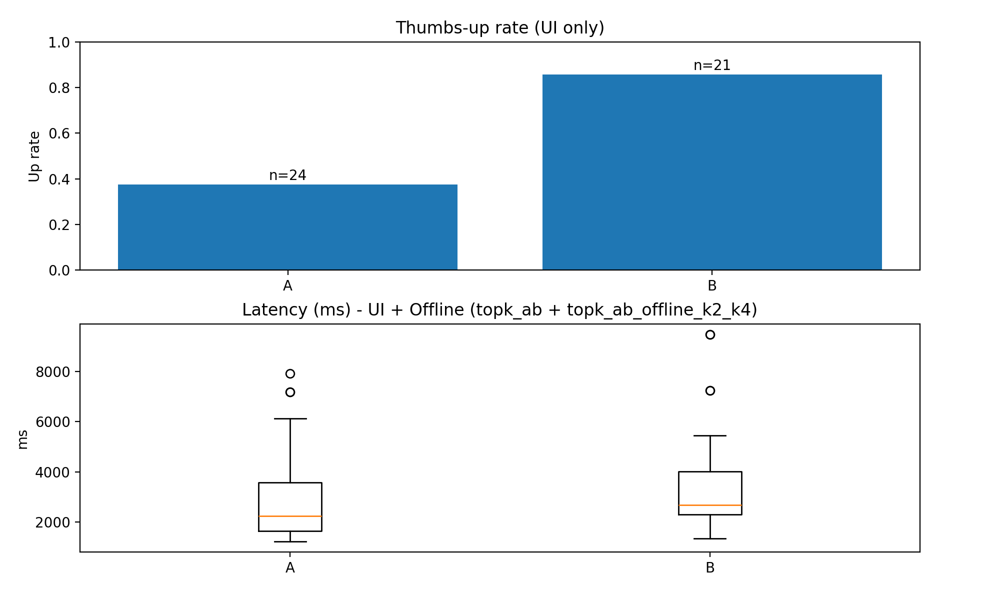

# RAG-based PDF Q&A with A/B Testing

A minimal end-to-end Retrieval-Augmented Generation (RAG) system that answers questions over a PDF and evaluates different retrieval settings using A/B testing.

---

## What it does
- Indexes a PDF into a vector database
- Answers questions using RAG
- Shows source snippets with page numbers
- Runs an A/B test on retrieval settings
- Logs user feedback and latency
- Analyzes and visualizes experiment results

---

## Architecture

```
PDF → Chunking → Embedding → Vector DB (Chroma)
                               ↓
                         Retriever (top_k)
                               ↓
                        LLM (OpenAI)
                               ↓
                   Answer + Source Pages
```

---

## A/B Testing Experiment

### Hypothesis
Increasing `top_k` from 2 to 4 will improve answer quality at the cost of slightly higher latency.

### Variants
| Variant| top_k |
|--------|-------|
|   A    |   2   |
|   B    |   4   |

### Metrics
- User thumbs-up rate (quality)
- Latency (ms)

---

## Results



### Quality (thumbs-up rate)
| Variant| Votes |   Rate  |
|--------|-------|---------|
| A (k=2)|   24  |  37.5%  |
| B (k=4)|   21  |  85.7%  |

### Latency
| Variant| Mean | Median |
|--------|------|--------|
|    A   | ~2.8s|  ~2.2s |
|    B   | ~3.2s|  ~2.7s |

### Conclusion
Increasing `top_k` from 2 to 4 improved user satisfaction significantly (37.5% → 85.7%) while adding about 0.5 seconds of latency.

**Recommendation:** Use Variant B (`top_k=4`) for better answer quality.

---

## Tech Stack
- Python
- LangChain
- OpenAI API
- Chroma (vector DB)
- Streamlit
- SQLite (experiment logging)
- Matplotlib (visualization)

---

## How to Run

### 1) Install dependencies
```
pip install -r requirements.txt
```

### 2) Index the PDF
```
python -m src.ingest --pdf "data/docs/islp_ch1-3.pdf"
```

### 3) Run the UI
```
streamlit run app/ui.py
```

### 4) Run offline A/B experiment
```
python -m src.run_experiment
```

### 5) Analyze results
```
python -m src.analyze
```

### 6) Generate plots
```
python -m src.plot_results
```

---

## Limitations
- Only text-based PDFs (no OCR support)
- No automated accuracy metric (human vote only)
- Single-document setup

---

## Next Steps
- Add multiple document support
- Deploy on cloud (Streamlit Cloud or AWS)
- Add automated evaluation metrics
- Test different chunking strategies